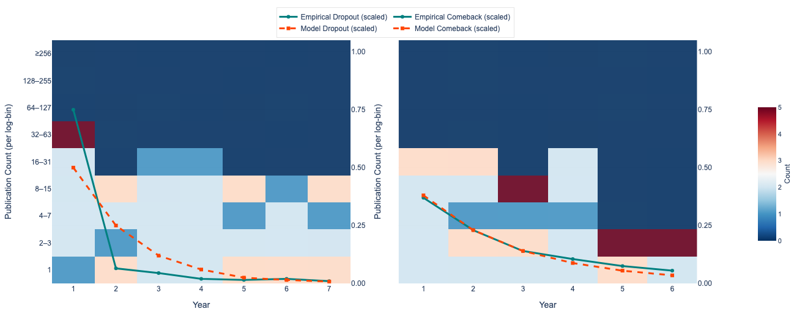
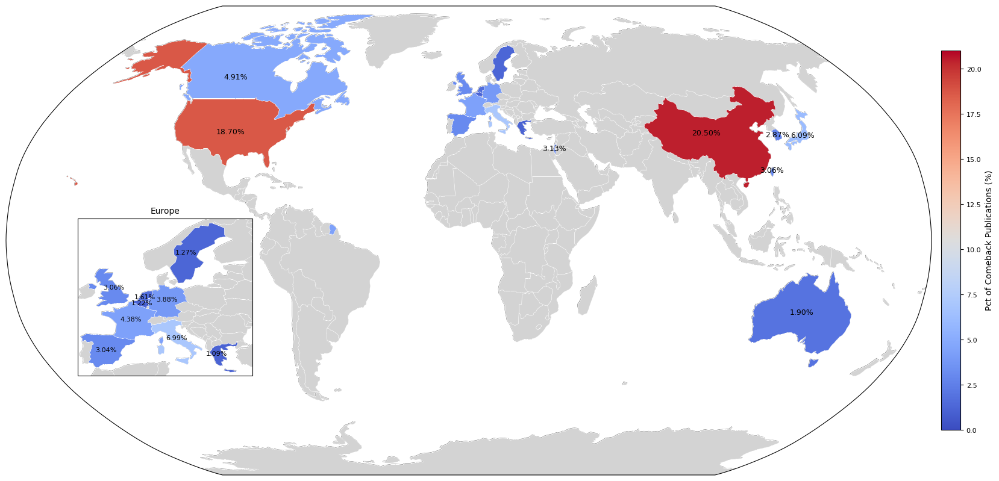
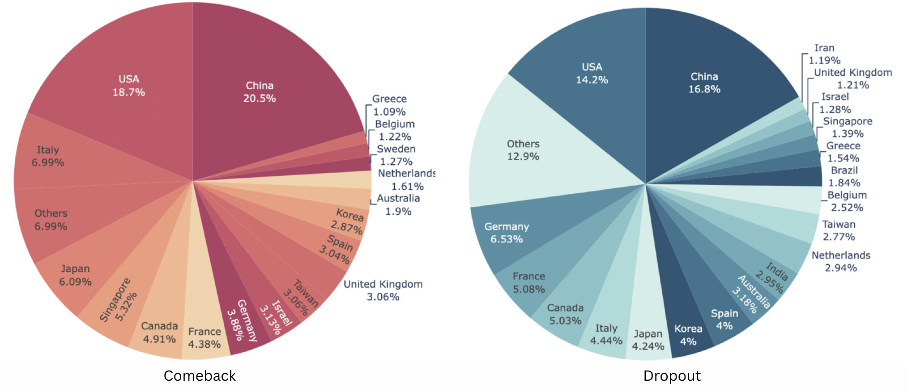

# 📉 Comeback or Dropout? What the Data Tells Us About Early Career Researchers

_Authored by: Somyajit Chakraborty_

> “Most of us fear failure, but for researchers, silence can be worse — years of no publications. What happens then? This study dives deep into that academic quiet.”

---

## 🧠 Background

In this blog, I share the motivation and mathematical depth behind our recently published paper: **"Comeback or Dropout: Study of Discontinued Researchers at Early Career Stage"**. We asked a simple but pressing question: what happens when early-career researchers stop publishing? Do they come back, or do they leave academia for good?

Using the large-scale AMiner Author dataset comprising over 113,000 researchers, we explored the depth and timing of discontinuation in academic careers and modeled the likelihood of return. Our results show the interplay between temporal gaps, collaboration strength, institutional support, and long-term scientific output.

---

## 🔍 What We Investigated

We addressed three core research questions:

1. What indicators help identify researchers with a three-year publication discontinuation during their first ten years?
2. What collaboration and temporal factors influence the likelihood of a comeback?
3. What distinguishes the dropouts from those who return?

To address these, we cleaned, modeled, and categorized researchers based on publishing gaps, collaboration metrics, and geographic/demographic data.

---

## 📊 Modeling Comebacks and Dropouts

We introduced an exponential probability model to capture the likelihood of an academic comeback:

```
p(CB, n) = α * exp(−β * n)
```

Here, \( n \) is the number of years after discontinuation. Our best fit model used \( α = 0.61 \), \( β = 0.48 \) and achieved a very low RMSE of 0.017, suggesting a sharp decay in comeback probability as time increases.



Similarly, for dropouts, the model was:

```
p(DO, n) = α * exp(−β * n)
```

With parameters \( α = 0.99 \), \( β = 0.69 \), it effectively captured the tendency of researchers to drop out early, especially in the first 2–4 years of their career.



---

## 📈 Productivity Insights

Our analysis reveals a stark contrast in productivity. Dropouts generally collaborated less, published in smaller author teams (average 1.89 authors/paper), and rarely published in journals. In contrast, come-back researchers, though struggling initially, showed stronger collaboration trends and published with larger teams (7.94 authors/paper).

The comeback group favored conference publications — possibly due to faster turnaround — while journal presence remained limited even post-return. Yet, a small subset did return to prolific publishing.


---

## 🌍 Academic Demographics Matter

The geographic and institutional demographics of researchers reveal substantial asymmetries in how different countries support or lose their early-career research talent. According to our analysis, the largest clusters of both discontinued and comeback researchers appear in countries with established research ecosystems such as the United States, China, and select European nations. These countries contribute the highest number of authors and publications in the AMiner dataset. However, deeper investigation into dropout and comeback trends reveals stark contrasts in institutional support, reintegration mechanisms, and national research priorities.

The United States leads in total researcher volume and continues to show strong comeback rates, benefiting from a mature academic culture and robust funding infrastructure. China, in contrast, not only exhibits a high researcher count but also shows remarkable progress in reintegrating researchers after discontinuation. It reflects an evolving academic environment where strategic national policies, such as state-backed talent programs and rapid infrastructure expansion, are starting to yield tangible results. This progress suggests that China could potentially overtake the US in both the scale and sustainability of academic contributions in the coming years.

India, while present among the top countries by researcher count, unfortunately shows disproportionately high dropout rates and strikingly low comeback percentages. Only around 1.74% of Indian researchers return after a publication hiatus, and their contribution to total post-comeback publication volume is marginal. This reflects systemic weaknesses in India’s research ecosystem, including a lack of structured postdoctoral pathways, heavy teaching loads in early academic careers, limited interdisciplinary exposure, and poor support for returning scientists. Many talented researchers in India leave academia early and transition to industry or civil service roles due to the absence of reentry grants, mentorship, or long-term career planning structures.

This contrast becomes even more pronounced when we examine institutional data. Top institutions in India show high dropout counts but relatively poor comeback productivity, indicating institutional rigidity or insufficient support mechanisms. On the other hand, Chinese institutions not only support a large number of researchers but also demonstrate stronger post-discontinuation productivity, showcasing the positive impact of mentorship structures, collaboration networks, and funding schemes aligned with national objectives.

Visual data underscores these findings. For example, Figure 7 (Comeback Authors by Country) and Figure 11 (Dropout Authors by Country) demonstrate how China maintains a better balance between the two categories, whereas India remains skewed toward permanent academic exit. Figure 13 (Dropout Institutions) and Figure 10 (Comeback Institution Publications) further illustrate the differences in institutional capacity to retain and reintegrate talent. While both China and the US lead in terms of comeback productivity, India’s dropouts are far less likely to resume publishing at a meaningful scale.

In conclusion, the global research ecosystem reveals an emerging divide. Countries like China are strategically positioned to surpass traditional leaders by investing in researcher reentry and continuity programs. In contrast, India’s potential remains underutilized due to structural inefficiencies that prevent early-career researchers from building resilient academic careers. Addressing these barriers could significantly boost India's scientific output and long-term academic sustainability.




---

## 🤝 Collaboration Patterns

One of the most defining differences between comeback and dropout researchers lies in their collaboration patterns, particularly in terms of the “popularity index” (pi) of their co-authors. This index reflects a researcher's influence within the academic network, measured through parameters like total citations, h-index, and publication volume. In our analysis, we found that comeback researchers typically re-integrated into academia by strategically aligning themselves with highly influential co-authors—those with significantly higher popularity indices. This suggests that successful return to academia is often mediated by mentorship, sponsorship, or network access to established researchers who are already well embedded within the scholarly ecosystem.

We found that the collaboration tendencies of comeback researchers reveal a clear pattern: researchers with moderate to high popularity indices often prefer to collaborate with others in a similar influence range. Low-popularity comeback authors tend to connect with peers in their own tier, but the ones who manage to rise post-comeback are those who bridge the gap—collaborating upwards with high-pi individuals. This vertical integration seems to provide not only visibility but also access to resources, high-quality venues, and research funding, which are crucial for reestablishing an academic presence after a publishing hiatus.

In contrast, dropout researchers frequently exhibit weaker collaboration networks. Their co-authorship profiles tend to be narrower, more isolated, and less connected to high-pi individuals. This isolation may stem from early-career limitations such as lack of institutional support, difficulty accessing elite research circles, or insufficient mentorship. Moreover, dropout researchers often work in small teams or publish solo, limiting the network effects and cumulative advantage that come with high-impact collaborations.

The gap in collaboration strength becomes even more significant when considering the trajectory of research careers. Comeback researchers who manage to publish again after a break often display increasing collaboration diversity, joining larger research groups or co-authoring with interdisciplinary teams. This not only accelerates their reintegration but also boosts their citation metrics and perceived productivity. On the other hand, dropout researchers usually show static or declining collaboration metrics leading up to their discontinuation, further reinforcing their marginalization from active scholarly networks.

Overall, our findings underscore that collaboration—especially with influential peers—is not just a nice-to-have but a critical factor in determining whether a discontinued researcher returns or exits academia permanently. Facilitating better access to collaborative networks, particularly for those at risk of dropping out, could be one of the most effective interventions for improving retention and career continuity in the research community.


---

## 💡 Implications and Call for Policy Reform

Our mathematical and empirical results suggest a need for early interventions:

- Support mechanisms in years 1–3 of a research career can drastically reduce dropout rates.
- Institutions should encourage collaboration between high and low “pi” researchers to buffer early-stage gaps.
- Career-break reentry grants and mentorship programs can help the comeback cohort thrive.

---
Want to read the full paper:
- Gayen, A., Chakraborty, S., Mitra, S. and Jana, A., 2025. Comeback or dropout: study of discontinued researchers at early career stage. Scientometrics, pp.1-36. [Read Here](https://idp.springer.com/authorize/casa?redirect_uri=https://link.springer.com/article/10.1007/s11192-025-05243-z&casa_token=WDN1VgKGSXcAAAAA:iU0wI0iVDV0IuN72CENgIL1AuS-YSTEOxK2PBkonG17cdgSs6pJu9LRna5gdZyOSOwOtjC53d6BPdN-69w)

_Thanks for reading! This study was a collaborative effort to shine a light on a silent but pressing problem in academia — and one we can address together._
