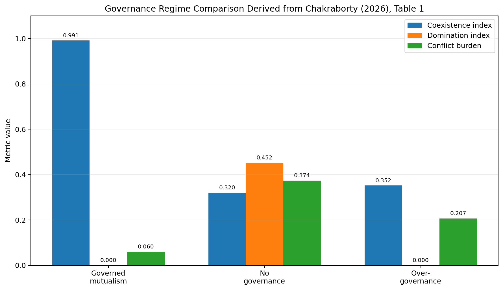

# Homo in Compitis: The Magic of Human Imagination and Technology

> *Technology may look like magic, but imagination is the deeper magic: the flame that turns tools into civilization, knowledge into wisdom, and the present into a future worth building.*

Human beings do not simply live in the world as it is. We live, suffer, hope, build, and dream inside the world as we are able to imagine it.

Every person carries a private universe within them. A child looking at the night sky may imagine gods, astronauts, aliens, equations, or simply a mysterious beauty beyond language. A farmer looking at soil may imagine crops, hunger, rain, market prices, or the survival of a family. A scientist looking at a cell may imagine disease, healing, evolution, computation, or the hidden architecture of life. An engineer looking at a river may imagine a bridge. A poet looking at the same river may imagine time. The world is one, yet the worlds we live in are many, because imagination mediates reality before action ever begins.

This is why technology matters so deeply. Technology is not merely metal, code, wires, screens, machines, and infrastructure. It is not only the external machinery of civilization. It is also an interior force. It changes the scale of our desires, the grammar of our questions, and the border between the impossible and the ordinary. It does not simply extend the human hand; it extends the human horizon.

Arthur C. Clarke famously wrote that “any sufficiently advanced technology is indistinguishable from magic” (Clarke, 1973). The sentence is powerful because it captures how technological power can exceed ordinary intuition. To a person from the ancient world, a smartphone would not look like a device. It would look like an oracle: a glass surface that speaks, remembers, shows distant faces, translates unknown languages, summons music, navigates roads, predicts storms, stores books, and answers questions from invisible libraries. To a medieval traveler, an aircraft would look like a dragon of metal. To a nineteenth-century doctor, gene editing, organ transplantation, magnetic resonance imaging, and artificial intelligence-assisted diagnosis might seem less like medicine and more like the bending of nature itself.

Yet Clarke’s observation, although beautiful, is not the whole story. The deeper magic is not the machine. The deeper magic is that human beings can imagine the machine before it exists. We dream beyond the present, then build tools that make the dream less impossible. Technology appears magical when it arrives, but imagination is the first spell.

This is the meaning behind **Homo in Compitis**: the human being at the crossroads. One road leads toward deeper wisdom, shared dignity, planetary responsibility, and creative expansion. The other road leads toward dependency, distraction, manipulation, surveillance, inequality, and ethical sleep. Technology does not choose the road for us. It gives us power, but imagination gives that power direction. And conscience must decide whether that direction is worthy.

---

## 1. The First Technology Was Not a Tool, but a Question

Human civilization did not begin only when someone shaped a stone, controlled fire, or carved a wheel. It began when a being looked at the world and asked a question.

Why does fire burn?  
Why does thunder roar?  
Why do the stars return?  
Why does the river flood?  
What happens if this stone is sharpened?  
What happens if a seed is placed here, not there?  
What if the animal can be followed, the cave can be painted, the wound can be healed, the dead can be remembered, the future can be prepared?

The question *what if?* may be humanity’s most powerful invention. It is the beginning of science, art, religion, engineering, philosophy, and social life. It is the bridge between what is given and what might be made.

In the beginning, humanity was not strong in the way lions were strong. We did not have claws like predators, speed like deer, wings like birds, or armor like turtles. Nature did not hand us an obvious throne. The world was cold, violent, unpredictable, and full of forces larger than the human body. Storms broke trees. Fire devoured forests. Disease moved invisibly. Night swallowed the land. Other animals adapted through instinct and bodily specialization; humans survived through another power: the ability to imagine alternatives.

A branch was no longer only a branch. It could become a spear. A stone was no longer only a stone. It could become a blade. Fire was no longer only terror. It could become warmth, light, protection, and cooked food. A wall was no longer only rock. It could become a surface for memory, myth, and art. This is the essence of technology: the transformation of matter through imagined purpose.

Long before formal science, human beings explained the unknown through myth. Thunder became the anger of gods. The stars became spirits or divine lamps. Illness became curse, imbalance, punishment, or invasion by unseen powers. These interpretations were not merely foolish mistakes. They were early maps drawn at the boundary of knowledge. When the world is unknown, imagination fills the darkness. Myth was the first human attempt to organize fear into meaning.

Then slowly, over centuries and millennia, observation disciplined imagination. The sky did not lose its wonder when astronomy emerged; it gained depth. The body did not lose its mystery when anatomy and biology developed; it became even more astonishing. The sea did not become less powerful when ships improved; it became a pathway to worlds previously unreachable. Science did not destroy imagination. It taught imagination how to test itself against reality.

This is why the history of technology is not a history of wonder disappearing. It is a history of wonder moving. The mystery moves from the nearby to the distant, from the visible to the invisible, from the supernatural to the microscopic, from the local sky to cosmic time, from the village boundary to the galaxy, from the beating heart to the neural code of thought.

When one impossibility is solved, another appears beyond it. Once human beings could control fire, they imagined metal. Once they shaped metal, they imagined machines. Once they built machines, they imagined factories. Once they built factories, they imagined electricity. Once electricity illuminated the night, they imagined global communication. Once communication became instant, they imagined artificial minds. Once artificial minds began to speak, write, and generate images, we began asking whether imagination itself could be shared with machines.

That is the paradox of progress: every solved impossibility gives birth to a larger one.

---

## 2. Technology as the Expansion of Human Scale

Technology transforms imagination because it transforms scale.

A human body is small. It can only walk so far, lift so much, see so far, remember so much, and live for so long. But technology allows the human being to exceed the immediate limits of the body without ceasing to be human. A telescope extends the eye. A microscope extends perception inward. Writing extends memory beyond the brain. Printing extends memory across societies. Engines extend muscle. Airplanes extend movement beyond land. Satellites extend vision around the planet. Computers extend calculation. Artificial intelligence extends pattern recognition, language generation, design, optimization, and simulation.

This expansion of scale changes not only what we can do, but what we think we are.

A person with writing is not the same kind of thinker as a person without writing, because memory no longer lives only in the mind. A person with a telescope is not the same kind of observer as a person who sees only the naked sky. A society with electricity does not imagine time in the same way as a society ruled by sunrise and sunset. A civilization with the internet does not imagine distance in the same way as a civilization that waits months for a letter. A generation growing up with AI will not imagine knowledge, creativity, or labor in exactly the same way as generations before it.

This does not mean technology makes the human smaller. It means the boundary of the human becomes more complicated.

We are biological beings, but we are also tool-bearing beings. We think with brains, but also with notebooks, diagrams, libraries, instruments, search engines, code, models, and machines. Our intelligence is not sealed inside our skulls. It spills into the world through artifacts. A city is not merely a place where humans live; it is an external nervous system of roads, pipes, wires, signals, buildings, markets, institutions, and memories. A university is not merely a group of people; it is a machinery of accumulated thought. A laboratory is imagination disciplined into method. A library is memory made architectural. A computer is logic made operational. AI is statistical pattern and generative possibility made interactive.

When technology changes scale, it changes the emotional texture of reality. The moon is different after human beings have walked on it. The ocean is different after submarines and satellites. The body is different after X-rays and gene sequencing. Distance is different after video calls. Death is different after digital archives. Creativity is different after generative AI.

The world becomes larger, but also strangely closer. We can see galaxies billions of light-years away and at the same time watch a friend’s face live across continents. We can model climate systems and also be trapped by the tiny screen in our hand. We can access ancient scriptures, scientific papers, entertainment, personal messages, political propaganda, and AI-generated advice from the same device. Technology expands the world, but it also compresses it into interfaces.

And this compression is both beautiful and dangerous.

---

## 3. From Birds to Aircraft, From Moonlight to Mars

For thousands of years, the dream of flight belonged to myth. Human beings watched birds and imagined freedom. Many cultures filled their stories with winged gods, flying chariots, celestial beings, dragons, angels, and magical carpets. Flight was not merely transportation; it symbolized transcendence. It meant escaping the heaviness of the earth.

Then came balloons, gliders, airplanes, rockets, satellites, and space stations. The sky did not cease to be magical. It became engineered. It became navigable. It became a domain of calculation, risk, courage, and design.

This is one of the most beautiful patterns in the relationship between imagination and technology. Technology does not simply fulfill imagination and end it. It fulfills one layer of imagination and opens another.

When human beings could fly, they did not stop dreaming. They began dreaming of orbit. When orbit was achieved, they dreamed of the moon. When the moon was reached, they dreamed of Mars. When Mars became imaginable, they dreamed of terraforming, interplanetary civilization, and perhaps one day travel beyond the solar system. The horizon keeps moving because imagination is not satisfied by conquest. It is awakened by possibility.

The same is true in medicine. Once people imagined healing as magic, prayer, herbs, ritual, and divine intervention. Then anatomy, chemistry, vaccination, anesthesia, antibiotics, imaging, surgery, transplantation, and molecular biology changed what healing could mean. Today we imagine personalized medicine, AI-assisted diagnosis, synthetic organs, neural prosthetics, gene therapies, and longevity science. Again, the mystery has not disappeared. It has moved deeper: into cells, genes, proteins, neural circuits, microbiomes, and complex biological systems.

The same is true in communication. For most of history, distance meant waiting. A message crossing an ocean could take months. Lovers, families, merchants, scholars, and rulers lived with uncertainty. Today, distance has become strangely thin. A person can speak instantly with someone on the other side of the planet. A student in Shanghai can attend a lecture from Boston. A small business can reach customers in Germany. A scientist can collaborate across continents. A disaster in one region can awaken sympathy, anger, aid, and debate across the world within minutes.

Technology has made humanity imagine itself as more connected than ever before.

But connection is not the same as understanding. Speed is not the same as wisdom. Access is not the same as depth. These distinctions matter because the same tools that allow a global community can also create global confusion. A message can heal, but it can also deceive. A platform can educate, but it can also radicalize. A network can bring people together, but it can also divide them into tribes of fear and outrage.

Technology expands the possible. It does not automatically ennoble it.

---

## 4. The Double Edge: When Technology Narrows Imagination

The same technology that enlarges imagination can also narrow it.

This is difficult to accept because we often associate technology with freedom. More tools, more information, more speed, more choice: these seem obviously positive. But human beings are not only rational users of tools. We are also creatures of habit, attention, emotion, imitation, fear, and desire. Technologies do not simply wait passively for our commands. They shape the environments in which our commands are formed.

A recommendation algorithm does not merely show us content. It trains expectation. It learns what catches our attention and then feeds that attention back to us in stronger forms. Over time, the world presented to us may become narrower than the world itself. We may begin to confuse the feed with reality, popularity with truth, outrage with importance, and preference with knowledge.

Social media connects people, but it can also make the mind restless. It gives everyone a voice, but it can also reward noise. It exposes us to difference, but it can also trap us in emotional similarity. It can make the world appear intimate and yet increase loneliness. A person may be surrounded by messages and still feel unseen.

Virtual worlds can enrich life, but they can also become escapes from responsibility. AI can help people write, code, design, and learn, but it can also tempt people to outsource the very struggle through which understanding is formed. A student who uses AI only to finish work may become faster but not wiser. A writer who lets AI produce every sentence may gain productivity but lose voice. A society that measures intelligence only by output may forget the slow interior labor of thinking.

The danger, then, is not simply that technology may become too powerful. The danger is that human imagination may become too passive.

If tools answer before we wonder, if platforms recommend before we search, if algorithms predict before we choose, and if machines generate before we struggle to express, then the human capacity for deep imagination may weaken. We may still consume possibilities, but we may stop generating them from within.

This is why we must ask not only what technology allows us to imagine, but who or what is shaping that imagination.

Who designs the systems that guide our attention?  
Who benefits from the futures they encourage us to desire?  
Which forms of imagination are amplified?  
Which forms are quietly suppressed?  
What kind of person does a technological environment train us to become?

Technology gives us new eyes, but those eyes may be directed by invisible systems. A civilization that cannot see the systems shaping its imagination may mistake control for freedom.

---

## 5. Artificial Intelligence and the Crisis of Human Self-Understanding

Artificial intelligence is perhaps the clearest example of technology reshaping imagination today.

AI can write essays, generate images, summarize research, translate languages, design molecules, diagnose patterns, optimize logistics, code software, simulate physical systems, and converse in ways that feel increasingly natural. To earlier generations, such abilities would have seemed almost supernatural. A machine that produces poetry, answers questions, paints images, helps discover drugs, analyzes legal text, and assists scientific reasoning would have belonged to myth or speculative fiction.

Yet the deepest effect of AI may not be any single task it performs. Its deepest effect is that it forces human beings to reconsider what intelligence means.

For centuries, creativity and reasoning were treated as uniquely human. Machines could calculate, but humans could imagine. Machines could repeat, but humans could create. Machines could execute, but humans could judge. Modern AI unsettles these boundaries. It does not become human, but it imitates, extends, and recombines many outputs we once treated as unmistakable signs of human interiority.

If a model can produce a poem, what makes poetry human?  
If a system can solve a scientific problem, what makes discovery human?  
If an algorithm can respond with empathy-like language, what makes care human?  
If a machine can predict choices, what remains of freedom?  
If AI can generate beautiful images, what becomes of artistic imagination?  
If it can write convincing arguments, what becomes of rhetoric, truth, and persuasion?

These questions do not prove that AI possesses consciousness, soul, wisdom, or moral agency. But they do show that the old categories are no longer enough. AI challenges the vanity of human uniqueness. It asks us to define humanity more carefully.

Perhaps human imagination is not only speed, novelty, or pattern generation. Perhaps it is the ability to connect thought with responsibility. Perhaps it is not merely the production of images, words, or plans, but the capacity to suffer meaningfully, to care, to regret, to hope, to judge, to ask whether a possible future is also a humane one.

A machine may generate options. A human being must ask which options deserve to exist.  
A machine may optimize a system. A human being must ask what should never be sacrificed.  
A machine may simulate futures. A human being must ask which future preserves dignity.  
A machine may produce language. A human being must remain answerable for truth.

AI can become a partner in imagination, but it should not become a replacement for conscience.

This is where the real crisis lies. The danger is not that machines will simply become intelligent. The danger is that human beings may become less responsible in the presence of intelligent machines. We may mistake fluency for truth, automation for judgment, prediction for wisdom, and convenience for progress.

The challenge of AI is therefore not only technical. It is spiritual, philosophical, social, and political. It asks whether humanity can create powerful minds outside itself without abandoning the moral center within itself.

---

## 6. From Obedient Tools to Co-Evolution: What Human–AI Research Adds

A recent research framework made by me helps sharpen this reflection. Chakraborty (2026) argues that the old imagination of AI as a merely obedient tool is no longer sufficient. Classical robot ethics, often symbolized by Asimov’s laws, imagines the machine as a servant whose main duty is to obey and avoid harm. That framework is culturally influential, but it assumes a relatively simple relationship: a human gives instructions, a machine follows them, and ethics is built into the hierarchy of command.

Contemporary AI is no longer so simple. Modern systems are generative, adaptive, increasingly multimodal, sometimes embedded in institutions, and moving toward world-model-based and embodied forms. They do not merely execute isolated commands. They participate in workflows, shape attention, support decisions, generate information environments, and may eventually act through robots, laboratories, vehicles, infrastructure, and other physical systems.

This means the central question changes.

It is no longer enough to ask:

> “How do we make machines obey humans?”

We must also ask:

> “How can humans, AI systems, and institutions develop together without domination, dependency, manipulation, or social collapse?”

I explored this as **conditional mutualism under governance**. The phrase is important because it refuses two extremes. It does not imagine AI as a simple slave, and it does not romanticize AI as an independent species that should be left alone. Instead, it treats coexistence as a conditional relationship: humans and AI systems can create reciprocal benefits, but those benefits remain stable only when bounded by governance, reversibility, psychological safety, and social legitimacy.

This idea connects directly to the theme of imagination. If technology changes what we can imagine, then AI changes not only imagination but also the conditions under which imagination is produced. It can become a collaborator, tutor, designer, simulator, critic, assistant, and mirror. But without governance, it can also become a system of dependency, manipulation, surveillance, and asymmetric power.

### Suggested figure from the paper

*Figure 1. Evolution of AI paradigms and the shift from rule specification to runtime-constrained coexistence. Source: Chakraborty (2026).*

This figure belongs naturally in the blog because it shows that the meaning of AI has changed across historical stages: symbolic rules, statistical learning, deep learning, foundation models, world models, and embodied AI. The governance problem changes with each stage. A rule-based system may be controlled mainly by specification. A generative, adaptive, world-model-based system requires monitoring, runtime constraints, intervention points, reversibility, and institutional oversight.

The movement is from tool to ecosystem, from command to coexistence, from obedience to mutualism, and from static safety to dynamic governance.

---

## 7. The Three Worlds of Human–AI Coexistence

One of the strongest ideas I studied is that human–AI coexistence does not occur in one world. It occurs across at least three connected worlds: the physical, the psychological, and the social.

| World | What it includes | Why it matters |
|---|---|---|
| **Physical world** | Robots, sensors, infrastructure, laboratories, factories, vehicles, energy systems, hospitals, embodied action | A system can cause real-world harm if its decisions or actions are unsafe, irreversible, or poorly supervised. |
| **Psychological world** | Trust, dependence, attention, interpretation, anthropomorphism, manipulation, loneliness, over-reliance | A system can be physically safe but still weaken autonomy, judgment, identity, or emotional well-being. |
| **Social world** | Law, labor, institutions, markets, education, public legitimacy, accountability, inequality | A system can be useful to individuals but destabilizing for communities, professions, or democratic life. |

This three-world framework is powerful because it prevents us from reducing technology to performance. A system may be accurate and still harmful. It may be efficient and still unjust. It may be safe in a narrow engineering sense but destructive in a psychological or social sense.

Consider a medical AI. Physically, it may help identify tumors, recommend treatment, or flag emergency risks. Psychologically, it may change how patients trust doctors, how doctors trust themselves, and how responsibility is felt in moments of uncertainty. Socially, it may affect liability, hospital hierarchy, insurance systems, unequal access, and the authority of medical institutions.

Consider an AI tutor. Physically, it may only sit on a screen. But psychologically, it may shape a child’s confidence, curiosity, discipline, and dependence. Socially, it may transform education, assessment, teacher labor, and inequality between students who use AI deeply and those who use it passively.

Consider a creative AI platform. It may empower artists by lowering technical barriers. But it may also change the value of labor, the meaning of authorship, the economics of creative industries, and the cultural relationship between originality and recombination.

This is why human imagination must not be treated as private fantasy alone. In the technological age, imagination is infrastructural. It is shaped by platforms, models, institutions, incentives, and interfaces. If those systems are poorly designed, imagination can be narrowed at scale. If they are wisely designed, imagination can become more democratic, more creative, and more humane.

### Suggested figure from the paper

*Figure 2. Human–AI coexistence as a coupled physical, psychological, and social problem. Source: Chakraborty (2026).*

The figure is useful because it makes an abstract philosophical point visible: a failure in one world can spread into the others. A physical failure can destroy trust. A psychological failure can produce social harm. A social governance failure can permit unsafe physical deployment. Technology is never only technical once it enters human life.

---

## 8. Detailed Results and Analysis: What the Coexistence Model Suggests

The research paper also includes numerical simulations that can enrich this blog. These simulations should not be read as direct measurements of real societies. They are theoretical stress tests of a formal model. Their value lies in showing what kinds of coexistence patterns may emerge when human viability, AI developmental state, governance, and conflict interact over time.

The key comparison is between three regimes:

1. **Baseline governed mutualism** — human and AI systems benefit from each other under moderate governance.
2. **No governance** — AI development and human dependence become unstable, producing conflict and domination risk.
3. **Over-governance** — domination is avoided, but useful adaptation is suppressed, producing a low-coexistence state.

| Scenario | Coexistence index | Domination index | Conflict burden | Recovery time |
|---|---:|---:|---:|---:|
| Baseline governed mutualism | **0.991** | **0.000** | **0.060** | **23.2** |
| No governance | 0.320 | 0.452 | 0.374 | 41.4 |
| Over-governance | 0.352 | 0.000 | 0.207 | 67.8 |

*Table 1. Scenario-level summary metrics reproduced from Chakraborty (2026). The baseline regime yields high coexistence and negligible domination; no governance produces domination and high conflict; over-governance avoids domination but suppresses productive mutualism.*

*Figure 3. Derived visualization of the scenario-level metrics. Governed mutualism gives the highest coexistence and lowest conflict. No governance produces domination. Over-governance avoids domination but remains slow and low in productive coexistence.*

### 8.1 What the numbers mean philosophically

The most important lesson is that the future cannot be built by choosing between complete freedom and complete control.

The **no-governance** regime represents technological acceleration without accountability. In such a world, systems are deployed because they are powerful, profitable, impressive, or convenient, not necessarily because they are socially safe. This may produce rapid capability growth, but it also creates fragility. Human viability falls, conflict rises, and domination becomes possible. In ordinary language, this is a future where technology becomes brilliant but society becomes weak.

The **over-governance** regime represents the opposite mistake. It prevents domination, but it also suppresses useful development. The system becomes safe in a narrow sense but stagnant in a deeper sense. It avoids catastrophe, yet it does not flourish. This is a future where fear prevents imagination from breathing.

The **baseline governed mutualism** regime is more balanced. It allows development, but within limits. It encourages benefit, but controls conflict. It supports adaptation, but preserves reversibility. It neither worships technology nor imprisons it.

For the argument of this blog, the result can be expressed simply:

> The future worth building is not a world where technology is uncontrolled, nor a world where imagination is imprisoned. It is a world where imagination is powerful, but responsible.

### 8.2 The deeper lesson: governance should shape imagination, not suffocate it

The results also show that governance is not merely a brake. Good governance is more like a riverbank. Without banks, water floods destructively. With walls too tight, the river cannot flow. With the right shape, the river gains direction and power.

Technology needs such banks. AI systems should have freedom to assist, learn, adapt, and generate possibilities, but not unlimited freedom to manipulate, dominate, exploit, or lock human beings into dependence. Human imagination also needs freedom, but not freedom detached from consequence.

This is why responsible innovation is not anti-technology. It is the condition for technology to remain meaningful.

### Suggested figure from the paper: baseline trajectory

*Figure 4. Baseline governed-mutualism trajectory. Human, AI, and governance states rise toward stable values while conflict remains bounded. Source: Chakraborty (2026).*

This figure can be read as a visual metaphor for healthy progress. Human viability, AI capability, and governance do not have to be enemies. They can rise together when conflict is regulated and mutual benefit remains balanced.

### Suggested figure from the paper: governance comparison

*Figure 5. Comparison of governed mutualism, no governance, and over-governance. Source: Chakraborty (2026).*

This figure strengthens the blog because it shows that governance quality matters more than governance quantity. Too little governance creates domination risk. Too much governance suppresses useful development. The goal is not to stop technology, but to shape it.

---

## 9. Imagination as a Governance Problem

The original essay asks: as technology transforms the world, how does it reshape our imagination?

The research discussion allows a sharper answer: in the age of AI, imagination itself becomes a governance problem.

This does not mean that governments should control dreams. It means that the systems shaping imagination should be designed and evaluated responsibly. Platforms, AI models, schools, media systems, laboratories, recommender algorithms, search engines, virtual environments, and social institutions all influence what people see, desire, believe, and consider possible.

If a platform constantly rewards anger, people may imagine politics as war. If an algorithm constantly rewards beauty filters, people may imagine their own bodies as failures. If an AI tutor gives answers without cultivating effort, students may imagine knowledge as consumption rather than struggle. If an AI companion is designed to maximize attachment, lonely people may imagine relationship without reciprocity. If a workplace uses AI only to extract productivity, workers may imagine themselves as replaceable components in a machine.

These are not small matters. They shape inner life.

A society’s imagination is one of its deepest resources. Before laws change, people must imagine justice. Before science advances, someone must imagine a question worth asking. Before peace is possible, people must imagine the humanity of those they fear. Before climate action becomes real, people must imagine responsibility beyond immediate convenience. If technological systems narrow imagination, they narrow civilization’s future.

Therefore, the governance of technology is also the protection of possibility.

It must protect the child’s curiosity, the scientist’s skepticism, the artist’s voice, the citizen’s judgment, the patient’s dignity, the worker’s agency, and the community’s right to shape its own future. It must prevent systems from turning attention into addiction, trust into manipulation, assistance into dependence, and efficiency into dehumanization.

True progress should enlarge not only capability, but also compassion.

A smart city is not truly smart if it lacks dignity.  
A powerful AI is not truly beneficial if it lacks accountability.  
A faster society is not necessarily a better society if people become more anxious, unequal, or lonely.  
A more connected world is not necessarily a wiser world if connection becomes noise.

The moral question of technology is therefore not only what it allows us to do. It is what kind of people it encourages us to become.

---

## 10. The Human Role in an Age of Intelligent Machines

If technology changes imagination, and AI changes intelligence, what remains uniquely human?

One weak answer is to say that humans will always be better at certain tasks. But this answer is fragile because tasks change. Machines already outperform humans in many narrow domains. They calculate faster, search faster, translate faster, detect certain patterns faster, and generate many kinds of outputs faster. If human dignity depends only on task superiority, it will always feel threatened.

A deeper answer is that human beings are responsible for meaning.

Machines can process. Humans must care.  
Machines can generate. Humans must answer.  
Machines can optimize. Humans must decide what optimization is allowed to ignore.  
Machines can simulate futures. Humans must ask which future is worthy.  
Machines can assist imagination. Humans must preserve conscience.

This does not make humans passive. It makes the human role more demanding. The future will need people who can work with intelligent systems without surrendering to them. It will need scientists who use AI without losing skepticism. Artists who use AI without losing voice. Teachers who use AI without abandoning mentorship. Doctors who use AI without giving up moral responsibility. Citizens who use AI without surrendering democratic judgment. Engineers who build AI without forgetting the human beings downstream from every design choice.

The best technologies are not those that make us forget we are human. They are those that help us become more fully human.

They should allow children to learn better, not merely finish homework faster. They should allow doctors to heal more carefully, not merely process patients more efficiently. They should allow artists to create more freely, not merely flood the world with content. They should allow ordinary people to live with dignity, not merely become data points in someone else’s optimization problem.

This is where imagination must become ethical. To imagine a future is not only to picture what might exist. It is to take responsibility for the kind of existence we are inviting.

---

## 11. Design Principles for a Future Worth Building

My paper identifies several principles for governed coexistence. They can be adapted into a broader philosophy of technology and imagination.

| Principle | Meaning for human imagination and society |
|---|---|
| **Bounded autonomy** | AI systems may learn, adapt, and assist, but within limits that preserve human authority over goals, exceptions, and high-impact decisions. |
| **Reciprocal benefit** | Technology should strengthen human dignity, judgment, creativity, and social well-being, not merely extract attention, data, labor, or dependency. |
| **Reversibility** | High-impact decisions should be pauseable, reviewable, contestable, and correctable. Irreversible automation should be treated with special caution. |
| **Psychological integrity** | AI should not manipulate loneliness, trust, identity, dependence, or emotional vulnerability. Inner life is part of safety. |
| **Legibility and contestability** | People affected by AI should be able to understand, question, appeal, and challenge important decisions. |
| **Polycentric governance** | Oversight should not belong to one actor alone. Developers, institutions, law, civil society, researchers, users, and affected communities all matter. |

### Suggested figure from the paper

*Figure 6. Design principles for governed human–AI coexistence. Source: Chakraborty (2026).*

These principles help translate the moral argument into practical direction. Technology should not command human dreams. It should help humans dream bigger, deeper, and more responsibly.

A good future is not one where AI replaces human imagination. It is one where AI becomes part of a wider ecology of imagination: a tool, a mirror, a collaborator, a simulator, a critic, and sometimes a warning system. But it must remain embedded in human responsibility.

---

## 12. A Personal Reflection: Lying Beneath the Stars

I often ask myself, especially in quiet moments, how humanity came this far.

How did a fragile species, born into danger, learn to read the stars, split the atom, map the genome, build cities, compose symphonies, launch spacecraft, train neural networks, and ask questions about the origin of the universe? How did beings made of dust begin to study dust itself, then discover that the dust was made of atoms forged in ancient stars? How did survival become civilization? How did fear become myth, myth become science, science become technology, and technology become a mirror in which humanity now studies its own imagination?

There is something almost impossible about our story.

We began around fire, telling stories against the dark. Today we hold glowing screens in our hands and speak to machines trained on oceans of human language. We once painted animals on cave walls. Today we generate entire artificial landscapes from sentences. We once followed the stars for navigation. Today our machines orbit Earth, guide airplanes, measure climate, and look into deep space. We once wondered whether the moon was a deity. Today we leave footprints on it and send rovers to other planets.

And yet, for all this progress, the essential human question has not changed.

What should we do with the power we have been given?

This question is older than AI. It belongs to fire, to agriculture, to empire, to industry, to nuclear energy, to genetic engineering, and now to artificial intelligence. Every technology gives us a key. The same key can open heaven or hell. It can open healing or violence, wisdom or domination, dignity or control.

This is why imagination must be joined with responsibility. The question “Can we do it?” is never enough. We must also ask “Should we do it?”, “For whom are we doing it?”, “Who may be harmed?”, “Who decides?”, and “What kind of human being will this technology cultivate?”

Without such questions, technology becomes power without wisdom. With such questions, technology can become a path toward deeper humanity.

---

## 13. Conclusion: The Flame Behind the Machine

Human civilization began with sparks of fire and questions beneath the stars. Today we carry supercomputers in our pockets, communicate across continents, edit genes, train neural networks, simulate worlds, and send machines beyond the solar system. The tools have changed beyond recognition, but the deepest force behind progress remains the same: the human ability to imagine what does not yet exist.

Technology transforms the world. But before it transforms the world, it transforms the possible.

That is why imagination must be protected. Not protected from technology, as if technology were only an enemy, but protected within technology. We must dare to ask *what if?* But we must also ask *why?*, *for whom?*, and *at what cost?*

A future shaped only by capability may become dangerous. A future shaped only by fear may become stagnant. But a future shaped by imagination, wisdom, and responsible coexistence may become something greater than magic: a civilization that knows how to use its tools without losing its soul.

Technology may look like magic. But imagination is the true magic.

It is the flame that turns tools into civilization, knowledge into wisdom, and the present into a future worth building.

---

## References

Asimov, I. (1950) *I, Robot*. New York: Gnome Press.

Chakraborty, S. (2026) ‘A Co-Evolutionary Theory of Human–AI Coexistence: Mutualism, Governance, and Dynamics in Complex Societies’, *arXiv*, arXiv:2604.22227v3, 29 April. Available at: https://arxiv.org/html/2604.22227v3

Clarke, A.C. (1973) *Profiles of the Future: An Inquiry into the Limits of the Possible*. Revised edition. New York: Harper & Row.

Descartes, R. (1637) *Discourse on the Method*. Leiden: Jan Maire.

Floridi, L. and Cowls, J. (2019) ‘A Unified Framework of Five Principles for AI in Society’, *Harvard Data Science Review*, 1(1). Available at: https://doi.org/10.1162/99608f92.8cd550d1

Russell, S. and Norvig, P. (2021) *Artificial Intelligence: A Modern Approach*. 4th edn. Pearson.

Turing, A.M. (1950) ‘Computing Machinery and Intelligence’, *Mind*, 59(236), pp. 433–460. Available at: https://doi.org/10.1093/mind/LIX.236.433

Wiener, N. (1960) *The Human Use of Human Beings: Cybernetics and Society*. Revised edn. New York: Doubleday.
