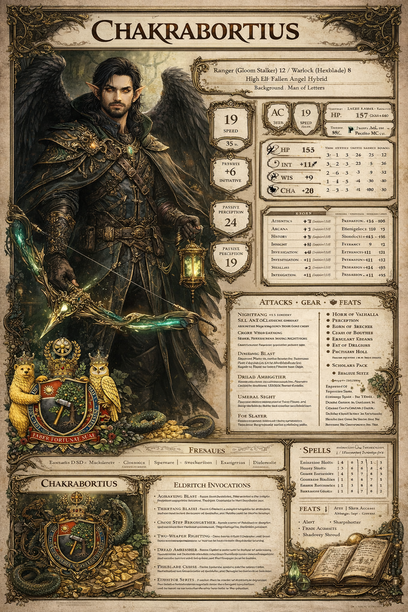

# Welcome to My Fantasy Closet (Yes, It’s in My Head)

If you ever wonder what lives in the “spare room” of my brain when I’m not doing real-life responsibilities, it’s usually a fully stocked library with secret passages, a star map pinned to the wall, and a suspiciously helpful stranger who definitely knows where the cursed artifact is buried. 
I’ve always loved fantasy—big, mythic fantasy and also the cozy kind where the team bickers like family, someone accidentally triggers a trap, and the solution is half courage and half cleverness. 
It’s the genre that makes ordinary life feel like it has hidden doors: a train platform that might be a portal, a dusty shelf that might be a key, a quiet decision that might be the moment the hero actually becomes the hero. 
I keep returning to Star Wars because it treats myth like an engine—temptation, redemption, found family, ancient orders, and that nagging question of what you do with power once you have it—and somehow it makes even a simple choice feel cinematic, like there’s a theme music cue waiting right behind the next sentence. 
I love how it balances glittering spectacle with moral gravity, how it reminds you that “the cool move” isn’t always the right move, and how the most important battles often happen inside a person, in the split second when they decide what kind of self they’re willing to be. On the other end of my fantasy heart is The Lord of the Rings, where the grandeur is real but the soul of the story is quiet: the long road, the worn boots, the friendships that hold when everything else breaks. 
What keeps pulling me back isn’t just kings and wars, but the insistence that small hands can carry heavy destinies, that loyalty and resilience are the true artifacts, and that courage sometimes looks like getting up again when no one is cheering. And because I’m also a lifelong fan of “let’s form a party and immediately make questionable decisions,” tabletop fantasy—especially D&D—might be my favorite kind of magic. 
I love the way a table turns into a shared world, where lore becomes a group project and the best moments aren’t “winning,” but the banter, the teamwork, and the weird plan that should not work and somehow does. There’s something deeply satisfying about watching a team combine brains, bravery, and one extremely suspicious clue to outrun a curse, decode a riddle, or talk their way out of an encounter they had no business starting. 
It’s the same reason I enjoy guild vibes in games and MMORPGs: the camaraderie, the quests, the slow stubborn leveling up, and the feeling that the story belongs to the group as much as to the individual. If you’ve noticed a pattern, yes—my sweet spot is adventure with warmth: treasure-hunting energy, relics and riddles, libraries and hidden vaults, light magic and clever teams, the kind of narrative that feels like a cozy caper even when the stakes are cosmic. All of that is probably why I ended up making a sigil—a coat of arms, my own little heraldic bookmark—not as a trophy, but as a reminder.
When I look at it, I don’t see “look at me”; I see a set of symbols quietly saying, “try to be the kind of person a good story would trust.” The bear is there for strength that stays gentle, the kind that protects without posturing, patient power that doesn’t need to shout. The owl stands for watchfulness and learning, the quiet judgment that listens first and asks better questions before making big moves. The crown is storybook “lordship,” but for me it’s not entitlement; it’s responsibility—if you lead in any way, even in small everyday ways, you owe people steadiness and fairness. 
The wheel above it carries the idea of cycles, discipline, and the turning path of practice, a symbol that connects neatly to the way I like to think about growth: not as a lightning strike, but as repetition, craft, and time. 
In the center, the tree with deep roots and the tool speaks my favorite kind of magic—building. The motto, FABER FORTUNAE SUAE, “maker of one’s own fortune,” is basically my personal spell: learn, create, repair, write, train, shape; don’t wait for destiny to arrive gift-wrapped, build something worthy of becoming. And because I’m a romantic in the harmless, nerdy way, I sometimes tell myself a bit of family lore—carefully labeled as a mythic mood, not a historical claim. 
My surname, Chakraborty, has a sound that invites archetypes: the wheel-turner, the learned steward, the “Man of Letters” type who treats knowledge as both responsibility and joy. On my most imaginative days, I’ll half-joke that my family is the epitome of old-world lordship and gentlemanly conduct, even that we carry echoes of Buddhist imagery and ideals; if someone asked for proof that we’re literal descendants of Buddha, I’d laugh and offer tea, because I’m not trying to write a genealogy chart so much as a personal north star. 
What I mean by “lordship” is simple and surprisingly practical: love books, respect learning, keep your word, be restrained with power, be generous with credit, protect people rather than dominate them, leave places better than you found them, and treat kindness as a form of strength rather than a performance.
That’s the tone I want my sigil to hold: not a megaphone, but a compass. So this is my blog-post confession in one breath: I’m powered by fantasy, anchored by a code, and kept light by humor. I don’t need to be a king to live the story; I just need to be the sort of person who can be trusted with a map, a lantern, and a library card—and if I get dramatic about it sometimes, that’s fine, because every decent hero gets dramatic at least once per chapter, preferably right before the party discovers that the “harmless relic” is, in fact, extremely not harmless.

## My DND Character Sheet ... Hey if any of you guys visiting here love to write fantasy stuff let me know!

### Chakrabortius Lucifeal — Level 20 (Melee + Mana Manipulation)
**Race:** High Elf (Fallen Angel Hybrid — homebrew flavor)  
**Classes:** Ranger 12 (Gloom Stalker) / Warlock 8 (Hexblade)  
**Combat Style:** **Melee striker** with **mana manipulation** (curses, siphons, shadow-weaving)  
**Background:** Sage / Lore-Hunter Arcanist (custom Sage)

---

### Character Background (short)
Lucifeal is a relic-hunter who learned the oldest truth of magic in the quietest places: knowledge is never free, and power is never neutral. Raised among archives and forbidden marginalia, he became the one scholars call when a ruin wakes up, a weapon remembers its name, or a spell refuses to stay dead. His hybrid bloodline—part high elf, part fallen celestial—doesn’t make him “holy” or “cursed”; it makes him *responsible*. He doesn’t fling magic like fireworks. He **manipulates mana** like a patient craftsperson: binding it into oaths, draining it through hexes, feeding it into blades, and pulling it out of the air when the world goes dark. In battle he strikes first from the edge of sight, wing-shadow folding around him, and he ends fights with quiet certainty—one cut, one curse, one stolen breath of power at a time.

---

### Skill Proficiencies (finalized for melee + arcanist-hunter)
- **Arcana** (Background: Sage)
- **History** (Background: Sage)
- **Perception** (High Elf: Keen Senses)
- **Investigation** (Ranger)
- **Stealth** (Ranger)
- **Survival** (Ranger)

#### Expertise (Tasha’s optional Ranger feature)
- **Deft Explorer: Canny** → **Expertise: Investigation** (you read traps, wards, and lies like footnotes)

---

### Racial Traits — High Elf (PHB)
- **Darkvision**
- **Keen Senses** (Perception proficiency)
- **Fey Ancestry** (advantage vs charm; magic can’t put you to sleep)
- **Trance**
- **Elf Weapon Training**
- **High Elf Cantrip**: *minor illusion* (classic shadow-misdirection)
- **Extra Language**

---

### Fallen Angel Hybrid Traits (homebrew flavor — DM-friendly)
> Use these to express “mana manipulation” without breaking the game.

- **Wings / Flight**: 30 ft (often restricted in heavy armor by table rules)
- **Mana Sense**: you can feel active magic/ongoing effects nearby (flavor; DM adjudicates)
- **Radiant-or-Necrotic Resistance**: choose one (fits “fallen” duality)
- **Once-per-Long-Rest: Veil Surge**: a brief aura/pulse (frighten OR weaken OR reveal) — pick one with DM
- **Cantrip-style Manifestation**: a minor light/shadow effect (pure utility)

---

### Background Feature — Sage / Lore-Hunter Arcanist
- **Researcher**: you usually know where/how to find obscure information
- **Languages**: typically **+2**
- Flavor: field-archivist, curse cataloger, ward-breaker

---

### Build Features (by class)

### Ranger 12 (Gloom Stalker)
#### Core Ranger (Tasha-leaning)
- **Favored Foe** (mark targets; “mana tether” flavor)
- **Deft Explorer**  
  - **Canny** (Expertise + languages)  
  - **Roving** (speed/climb/swim boosts)  
  - **Tireless** (temp HP + exhaustion support)
- **Fighting Style (final pick): Defense** (+1 AC; works with melee + survivability)
- **Spellcasting (Ranger)** (utility + control)
- **Extra Attack** (Ranger 5)
- **Land’s Stride** (Ranger 8)
- **Nature’s Veil** (brief invisibility; “shadow-phase” flavor)
- **ASI/Feats from Ranger**: at **4, 8, 12**

#### Gloom Stalker Subclass
- **Dread Ambusher** (initiative boost + extra attack/damage on round 1)
- **Umbral Sight** (darkness mastery; invisible to darkvision in darkness)
- **Iron Mind** (Wisdom save proficiency)
- **Stalker’s Flurry** (turn a miss into another chance once/turn)

---

### Warlock 8 (Hexblade)
#### Core Warlock
- **Otherworldly Patron: Hexblade**
- **Pact Magic** (slots refresh on short rest = “mana cycles”)
- **Pact Boon (final pick): Pact of the Blade** (blade as a mana conduit)
- **Eldritch Invocations: 4 total**
- **ASI/Feats from Warlock**: at **4, 8**

#### Hexblade Features
- **Hexblade’s Curse** (signature “mana siphon mark”)
- **Hex Warrior** (charisma-fed weapon mastery)
- **Accursed Specter** (slain foes echo as a spectral servant)

---

### Eldritch Invocations (finalized for melee + mana manipulation)
Pick these 4:
- **Thirsting Blade** (extra attack with pact weapon)
- **Eldritch Smite** (convert mana into explosive impact; knockdown)
- **Devil’s Sight** (see in magical darkness; perfect for shadow tactics)
- **Improved Pact Weapon** (stronger pact blade; “refined mana channel”)

---

### Feats / ASIs (final set for melee + mana control)
You have **5 total** (Ranger 4/8/12 + Warlock 4/8). Suggested final picks:

1. **War Caster** — keep spells up while fighting; cast with hands full
2. **Elven Accuracy** — surgical precision when you have advantage (very “high elf duelist”)
3. **Alert** — act first; enable your Gloom Stalker opening strike
4. **Tough** — survive front-line pressure (or swap for Resilient if your table prefers)
5. **Great Weapon Master** *(if using heavy melee)* **or** **Fighting Initiate (Dueling)** *(if sword + shield)*

---

### “Mana Manipulation” (how it plays at the table)
Your “mana manipulation” shows up as:
- **Marks & Curses:** Hexblade’s Curse, Favored Foe
- **Shadow-phase movement:** Nature’s Veil + Gloom Stalker darkness kit
- **Mana-to-blade conversion:** Eldritch Smite, Pact Blade, short-rest slot cycling
- **Control-by-presence:** Devil’s Sight + magical darkness tactics (if you take *darkness*)

---

### Notes
- “Fallen Angel Hybrid” is homebrew: finalize resistances/flight limits with your DM.
- This build is designed to feel like a **duelist-hexer**: you open fast, lock a target, and turn spell slots into lethal melee bursts.

